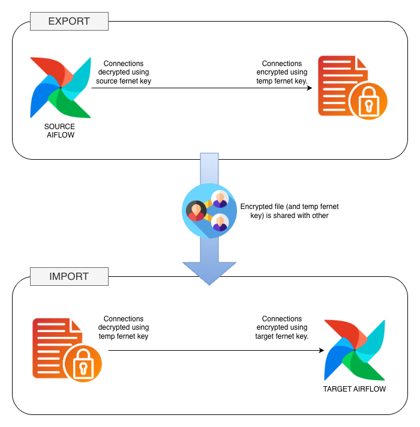

# Airflow Connections Migration Utility

This utility provides a secure way to export and import Airflow connection records between Airflow environments that use different Fernet encryption keys.

It is designed for safely sharing connection definitions across teams without exposing sensitive credentials.

While it could technically be used in productions environments, it has been designed to be used by developers and data engineers to quickly share connections and have their dev environment ready sooner and aligned with each other.

It can also be used as a very basic way to keep connections updated when connection details are rotated often.


## Implementations

This tool is available in three different implementations:

| Implementation | Interface         | Repository                                                                                         |
|----------------|-------------------|----------------------------------------------------------------------------------------------------|
| **Python**     | CLI               | [airflow_connections_import_export](https://github.com/flevanti/airflow_connections_import_export) |
| **Swift**      | Native macOS app  | [AirflowConnectionMigrator](https://github.com/flevanti/AirflowConnectionMigrator)                 |
| **Go**         | Web server or TUI | [airflow-migrator](https://github.com/flevanti/airflow-migrator)                                   |

All implementations share the same Fernet encryption format, so exported files are interchangeable between them.
> As part of the Swift implementation, a standalone Fernet encryption library was developed and
> released: [SwiftFernet](https://github.com/flevanti/SwiftFernet)


## Overview

The workflow consists of:

1. Exporting connections from a source Airflow instance.
2. Re-encrypting the full connection record using a temporary *shared-file* Fernet key.
3. Sharing the encrypted CSV file plus the shared-file key.
4. Importing connections into a target Airflow instance using the target system's Fernet key.

The visual workflow is shown below:



---

## Features

- Read connections directly from the Airflow metadata Postgres database.
- Decrypt sensitive fields using the source Fernet key.
- Re-encrypt the full record into a JSON payload using a temporary/shared-file key.
- Optional prefixing of connection IDs to avoid downstream collisions.
- Import side re-encrypts sensitive fields using the target system's Fernet key.
- Validates that no connection IDs already exist before inserting.
- Prompts for confirmation before performing the write.
- Supports automated CLI usage or interactive prompts.

---

## Requirements

- Python 3.10+
- `cryptography`
- `psycopg2`
- Access to the Airflow metadata database.
- Fernet keys for the source system, shared file, and target system (depending on the operation). 

Airflow Fernet keys can be retrieved in the configuration file of the instance or, more easily, through the UI `admin`→`config`→`core`→`fernet_key`.

The Fernet key used to encrypt the file can be provided or can be automatically generated by the script.

---

## Usage

Run the script interactively:

```
python airflow_connections_export_import.py
```

You will be prompted for:

- Operation (Export or Import)
- Fernet keys
- Connection ID prefix (Optional for export)

---

### Export Example (Interactive)

```
python airflow_connections_export_import.py
```

Choose **E** for export when prompted.

Output:

- `airflow_connections.csv`
- A Fernet key for the shared file (shown on screen if generated)

---

### Export Example (CLI)

```
python airflow_connections_export_import.py     --operation E     --decrypt-key <SOURCE_FERNET_KEY>     --encrypt-key <TEMP_FILE_FERNET_KEY>     --conn-id-prefix test_
```

---

### Import Example (Interactive)

```
python airflow_connections_export_import.py
```

Choose **I** for import when prompted.

---

### Import Example (CLI)

```
python airflow_connections_export_import.py     --operation I     --decrypt-key <TEMP_FILE_FERNET_KEY>     --encrypt-key <TARGET_FERNET_KEY>
```

---

## Connection ID Prefixing

To avoid collisions when importing into another Airflow environment, you can add a prefix (max length: 10 characters):

```
--conn-id-prefix migration1_
```

---

## Output File Structure

The exported CSV contains:

| conn_id | encrypted_connection |
|---------|----------------------|
| my_conn | <Fernet-encrypted JSON> |

The JSON includes the full connection row from Airflow.

---

## Important Notes

- The script does **not** modify Fernet keys in Airflow.
- It only migrates connection records between systems that already have their Fernet keys configured.
- Sensitive fields remain encrypted at all times outside the memory of the running program.
- For security, never store the shared-file Fernet key inside the CSV file.
- When sharing the file and the Fernet key make sure the file and the key don't travel together.

---

## License
This tool is released under the Apache 2.0 License and provided without warranty. 

Use at your own risk.

